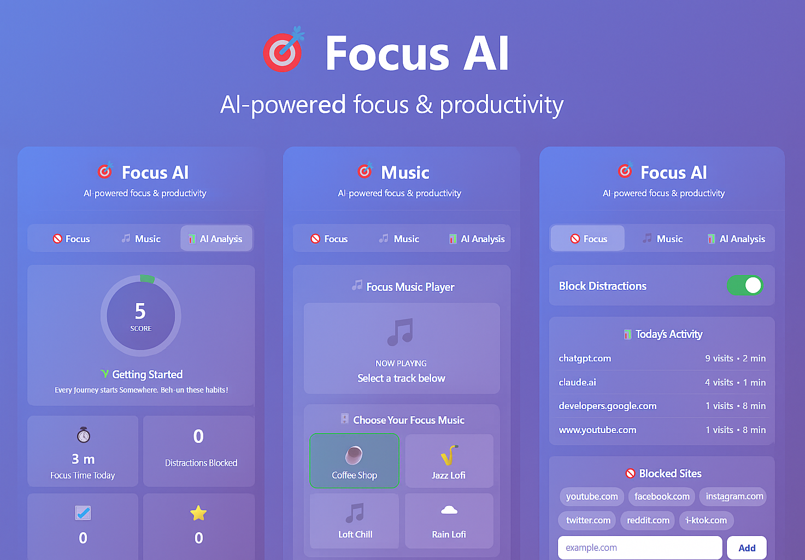

# 🎯 Focus AI — Chrome Productivity Extension

> **Stay focused, block distractions, and boost your productivity** with **Focus AI** — an AI-powered Chrome extension designed to help you stay in flow. It combines website blocking, relaxing background music, and productivity analytics — all in one clean, modern interface.

---

## 🌟 Features

### 🚫 Block Distractions
Stay focused by blocking time-wasting sites like YouTube, Instagram, and Twitter with a single toggle.

### 🎵 Focus Music
Listen to background **Lo-Fi**, **jazz**, and **rain** sounds to stay calm and productive while working or studying.

### 📊 AI Analytics
Visualize your productivity habits with smart analytics, daily focus stats, and a 7-day focus chart.

### 💎 Modern Design
Beautiful, minimal, and responsive popup UI built to keep your workspace distraction-free.

---

## 🧩 Installation Guide

### 🪄 Step-by-step setup:

1. **Download the ZIP file:**  
   👉 [Click here to download Focus AI](downloads/FocusAI.zip)

2. **Extract the ZIP** to a folder on your computer.

3. Open Google Chrome and go to:
   ```
   chrome://extensions
   ```

4. Enable **Developer Mode** (toggle in the top-right corner).

5. Click **Load unpacked** and select the extracted Focus AI folder.

6. ✅ You’re all set! Focus AI will now appear in your Chrome toolbar.

---

## 💡 How It Works

- Toggle **Block Distractions** to instantly block distracting sites.
- Play background **Lo-Fi music** or add your own tracks.
- Check your **AI Analytics** tab to see daily focus scores and trends.

---

## 🖼️ Visual Preview

<div align="center" style="display: flex; flex-wrap: wrap; justify-content: center; gap: 20px;">
  
</div>

---

## ⚡ Tips for Best Experience
- 🎧 Use **Music Mode** with your favorite track while working.
- 📈 Review **AI Analytics** daily to improve your focus streak.
- 🚀 Customize your blocked sites list anytime from the Focus tab.

---

## 👨‍💻 Author
**S Lalit Kumar**  
📍 Bengaluru, Karnataka  
📧 slalit1369@gmail.com  
🔗 [LinkedIn](https://www.linkedin.com/in/s-lalit-kumar-95ab87254) | [GitHub](https://github.com/SLK007588)

---

## 📜 License
Released under the **MIT License** — free to use, learn, and build upon.

> _Made with ❤️ for productivity and peace of mind._
